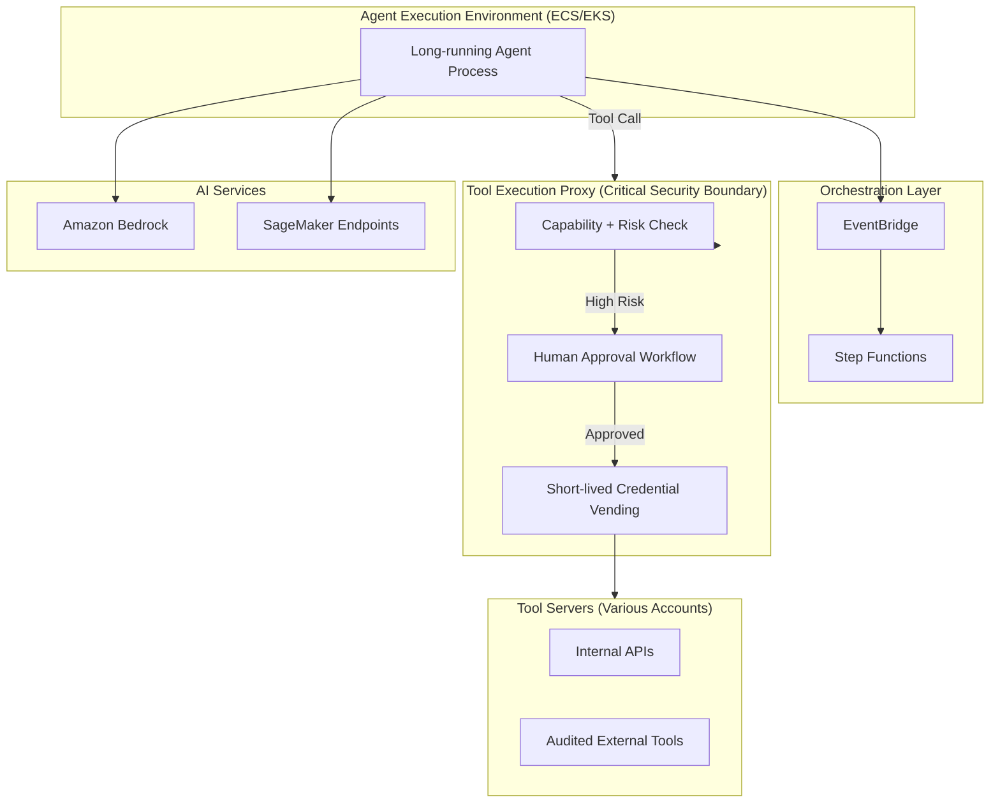

# Agent Platform — Core Architecture

## High-Level Components

## Key Design Points

- **Tool calls never go direct** from the agent runtime to the actual tool backend for anything above "low" risk.
- The **Tool Execution Proxy** is the single most important security component.
- Long-running state and human approval workflows are modeled in Step Functions.
- All AI model calls are routed through PrivateLink where possible.

## Observability

Every agent turn should produce:
- Full X-Ray trace (including model and tool subsegments)
- Structured logs with session ID, agent ID, and cost metadata
- Trajectory events published to EventBridge for evaluation pipelines

This architecture is intentionally more complex than "just call Bedrock from Lambda" because the requirements around security, audit, cost control, and human oversight are significantly higher.
